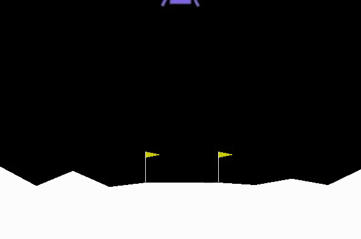

# Moon Landing using Deep Reinforcement Learning



Here I train a DRL agent using Deep Q-Learning to perform Moon Landing within the OpenAI Gym's environment.  

Train the agent using the script ```train_agent.py``` and test how well the agent performs using the script ```test_agent.py```.  

It uses PyTorch for training the agent. The conda environment can be installed from ```gym.yml``` file as ```conda env create -f gym.yml```. 

### Pipeline

 - Create 2 models.
 - For episode in total number of episodes:
    - For step in total number of steps:
        - Select a greedy action ‘a’ using the prediction by model 1 for state ‘s’.
        - Apply the action. Observe next state AND reward.
        - Store these in memory for replaying through them later.
        - If **N** number of steps have been observed, go into the learning stage using the experience so far.
        - Sample a batch of length N from the memory.
            - For vectors of ‘s’, predict set of action-value vector using model 2.
            - Update the action-value vector using an algorithm such as sarsamax, or expected sarsamax.
            - Train Model 1 (optimize using back-propagation with MSE loss) to bring the output of Model 1 closer to output of Model 2.
            - Copy the network weights from Model 1 to Model 2 using ‘soft-update’ function.
        - Repeat